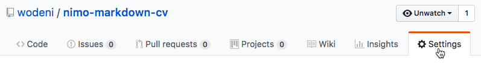
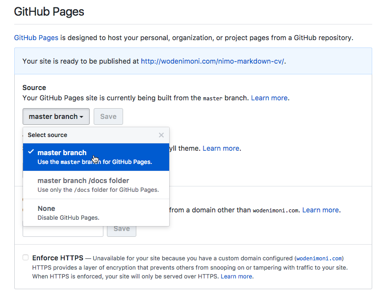

you can see my curriculum vitae [here](https://github.com/skywalker-dell/CV/settings/pages).
***

## Getting started

To start, simply [fork the nimo-markdown-cv repo](https://github.com/wodeni/nimo-markdown-cv)

Your resume content will be contained in `index.md`, which has an example cv. Start by modifying `index.md`! To see the result, you have two options:

## Using Github Pages to publish it online

1. Go to *Settings* of you git repo. 
2. In the *Github Pages* section, choose *master branch*, which will automatically build your cv and serve it on your free GitHub Pages website. 
3. Head to *yourusername*.github.io/nimo-markdown-cv to see your beautiful CV.

Any change you want to make to your CV from then on would have to be done on the `master` branch and will be immediately rendered by Github Pages.

## Build it locally and print a PDF

1. [install jekyll](https://jekyllrb.com/docs/installation/) on your computer. `gem install jekyll` will do for most users.
2. Clone your fork on your computer
3. Type `jekyll serve` and you'll be able to see your CV on your local host (the default address is http://localhost:4000).
4. You can edit the `index.md` file and see changes live in your browser.
5. To print a PDF, just press *Print*. Print and web CSS media queries should take care of the styling.

## Build it locally by docker

1. Clone your fork on your computer
2. Type `make build` to set up service
3. Type `make` or `make start`  to start service, then your can open `localhost:4000` on your local host to see your CV
4. You can edit the `index.md` file and see changes live in your browser.
5. Since the `jekyll-pdf` does not work well with this repo, try using Chrome's print feature, just right-click in your browser and click *print* tag

## Generating PDFs in one command

You can optionally integrate [jekyll-pdf](https://github.com/abeMedia/jekyll-pdf) to the package and automatically generate the PDF along with the HTML version. See more instructions in the [repo](https://github.com/abeMedia/jekyll-pdf). As of 02/07/2019, `jekyll-pdf` does not work well with this repo.

